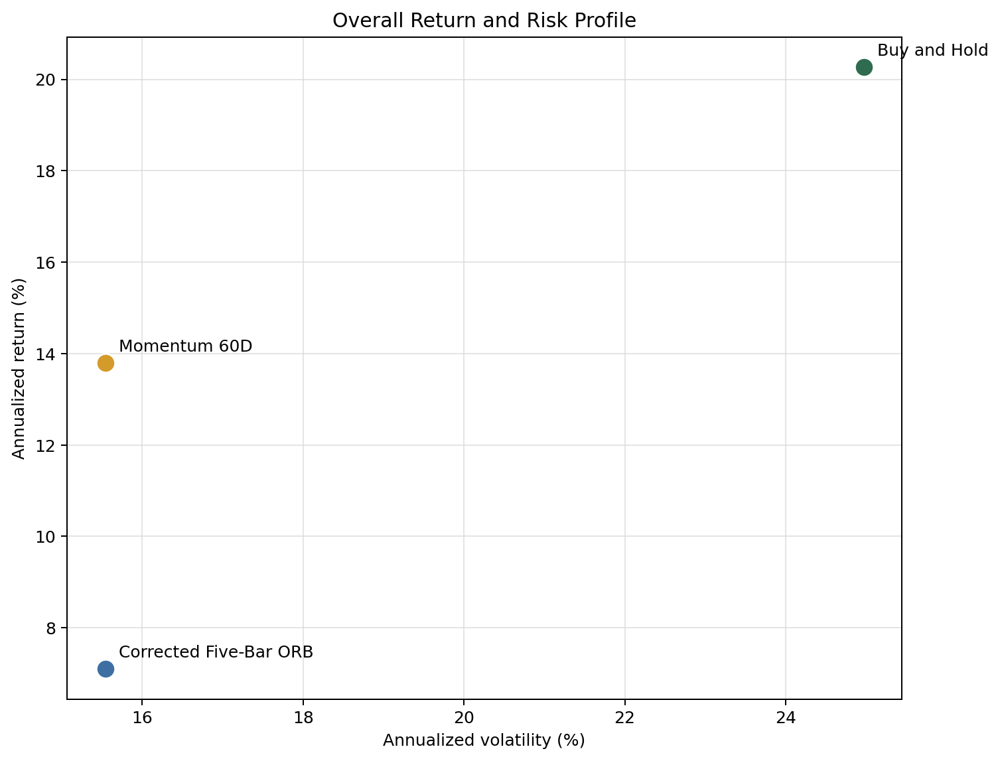
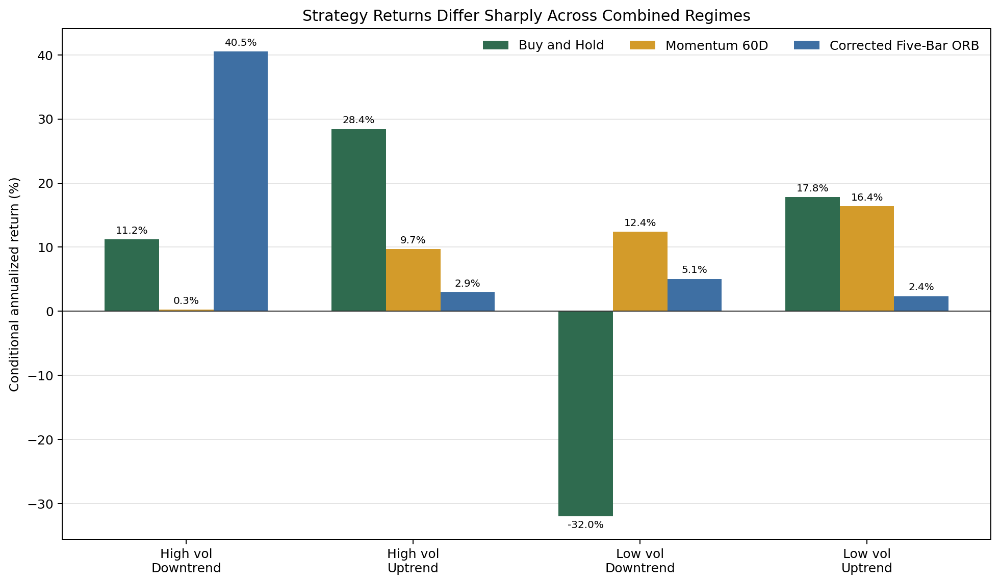

# Cross-Strategy Regime Analysis

## Overview

This project tests whether different strategy families behave differently
across market regimes.

Three QQQ strategies are compared:

1. Buy and hold.
2. A daily 60-day momentum strategy.
3. A corrected five-bar opening range breakout strategy.

The project is QuantConnect-first. QuantConnect supplies the market data,
execution engine, fills, fees, and portfolio statistics. This repository
preserves every experiment, records the results, and builds the final
cross-strategy comparison.

## Research Question

How do different strategy types perform across different market regimes?

The initial hypothesis was that strategy performance would vary with
volatility and trend. A strategy suited to a low-volatility uptrend might
behave very differently in a high-volatility downtrend.

## Regime Definitions

All tradable regime labels use information available before the return being
evaluated:

- **Volatility:** 20-day realized volatility compared with the rolling median
  of the previous 252 realized-volatility observations.
- **Trend:** QQQ's prior close compared with its trailing 200-day moving
  average.
- **Combined regimes:** high-volatility downtrend, high-volatility uptrend,
  low-volatility downtrend, and low-volatility uptrend.

Today's strategy return is assigned yesterday's completed regime label. The
current close can only define the next trading day's regime. This avoids using
future information to classify a return.

## Canonical Strategies

### Buy and Hold

Buy QQQ once and remain invested. This is the return benchmark.

### Daily Momentum

Calculate QQQ's trailing 60-day momentum after the close. Hold QQQ when
momentum is positive and otherwise hold cash. Position changes use explicit
next-session MarketOnOpen orders.

### Opening Range Breakout

Build the opening range from the five one-minute bars ending at 9:31 through
9:35. Beginning with the 9:36 bar, enter long after a close above the range
high. Use no stop or profit target, block late entries, and liquidate five
minutes before the session close.

The ORB implementation was corrected after an audit found that the legacy
Projects 2 and 3 code effectively used four completed range bars and could
accept entries after the intended liquidation time.

## Overall Results

QuantConnect's official full-strategy statistics were:

| Strategy | CAGR | Sharpe | Max drawdown | Net profit | Orders | Fees |
|---|---:|---:|---:|---:|---:|---:|
| Buy and hold | 19.757% | 0.605 | 34.8% | 211.712% | 1 | $2.40 |
| Momentum 60D | 13.729% | 0.538 | 14.3% | 125.381% | 63 | $132.43 |
| Corrected ORB | 7.063% | 0.188 | 17.6% | 54.010% | 2,610 | $4,175.02 |

The canonical runs end within several trading days of one another, rather than
on one identical date. The regime comparison CSV preserves each source
experiment and end date.



Buy and hold maximized raw return but also had the largest drawdown and
volatility. Momentum sacrificed return while materially reducing drawdown.
ORB produced the weakest overall return and risk-adjusted performance while
requiring far more turnover and fees.

## Regime Results



The figure reports conditional annualized returns for each regime. These are
annualizations of non-contiguous regime days, not calendar CAGRs.

### Buy and Hold

- Strongest in high-volatility uptrends: 28.45% conditional annualized return.
- Also strong in low-volatility uptrends: 17.84%.
- Weakest in low-volatility downtrends: -31.99%.
- Best overall return, but highly dependent on favorable trend conditions.

### Momentum

- Strongest in low-volatility uptrends: 16.37%.
- Produced 12.43% in low-volatility downtrends, though that bucket contained
  only 61 days.
- Was nearly flat in high-volatility downtrends.
- Reduced risk rather than maximizing return.

### Opening Range Breakout

- Strongest in high-volatility downtrends: 40.51% conditional annualized
  return and 1.716 Sharpe-like.
- Weak in both uptrend regimes.
- Signal frequency was almost identical in high and low volatility, so the
  regime difference came from conditional payoff behavior rather than more
  frequent trading.
- Remained a weak and execution-sensitive standalone strategy.

## Robustness Tests

### Momentum

The unchanged 60-day momentum strategy was tested in two predefined periods:

- **2020-2022:** momentum gained 33.90% versus 25.60% for QQQ.
- **2023-2026:** momentum gained 68.32% versus 154.13% for QQQ.

Momentum was more competitive during the earlier stressed period but incurred
large opportunity costs during the later bull market. This supports describing
it as a defensive exposure filter, not a stable return leader.

Twenty-day and 120-day lookbacks also remained profitable, providing partial
parameter robustness. The 20-day version had higher return but also more
turnover, fees, and drawdown. It was not selected merely because it looked
best.

### Opening Range Breakout

The high-volatility downtrend relationship remained positive in both
predefined periods:

- **2020-2022:** 14.93% cumulative conditional return over 192 days.
- **2023-2026:** 21.60% over only 56 days.

The direction survived, but the magnitude did not. The later bucket's very
large annualized estimate is mechanically amplified by its small,
non-contiguous sample. The evidence is therefore partially robust, not proof
of a dependable trading filter.

## Execution Lessons

Execution details materially changed the research:

- A scheduled daily-data rebalance was converted by QuantConnect into a
  MarketOnClose order, contradicting the intended next-open description.
- Explicit MarketOnOpen execution reduced 60-day momentum's cumulative return
  from the synthetic 139.09% estimate to 125.38%.
- Correcting ORB's range timing weakened its historical result.
- ORB generated 2,610 orders and more than $4,100 in fees.
- Project 3 separately showed that small slippage assumptions can erase a weak
  high-turnover edge.

These findings reinforce that strategy logic and execution modeling cannot be
interpreted independently.

## Conclusion

The initial hypothesis is supported: the three strategy families exhibited
meaningfully different regime profiles.

- **Buy and hold** was the strongest return strategy and dominated favorable
  uptrends, but carried the most market risk.
- **Momentum** behaved as a defensive participation rule. It lowered drawdown
  and was more useful during stressed periods, but gave up substantial upside.
- **ORB** was weak overall but behaved most distinctly in high-volatility
  downtrends.

No strategy was uniformly best. The evidence supports regime sensitivity, but
does not establish a reliable regime-switching portfolio. Building such a
portfolio would require a separate hypothesis, allocation rules fixed in
advance, out-of-sample testing, and realistic execution analysis.

## Limitations

- The study uses only QQQ and one broad 2020-2026 sample.
- The sample contains few independent market cycles.
- Some combined-regime buckets are small.
- Conditional annualized returns are not calendar-period CAGRs.
- Strategy source runs differ by several final trading days.
- The study does not test statistical significance or confidence intervals.
- Momentum cash returns are treated as zero; interest on cash is not modeled.
- ORB remains sensitive to fills, fees, slippage, and exact bar timing.
- No cross-strategy allocation or regime-switching portfolio was backtested.
- Positive historical results do not establish live tradability.

## Experiment Map

| Stage | Experiments | Purpose |
|---|---|---|
| Benchmark | EXP-001 | Map QQQ buy-and-hold returns by regime |
| Momentum development | EXP-002 to EXP-007 | Test baseline, filters, and lookbacks |
| Execution audit | EXP-008 to EXP-009 | Align stated and actual momentum execution |
| Daily comparison | EXP-010 to EXP-011 | Compare buy-and-hold and momentum, then split the sample |
| ORB audit | EXP-012 to EXP-013 | Correct opening-range and end-of-day timing |
| ORB regime analysis | EXP-014 to EXP-015 | Measure regime behavior and subperiod stability |

## Reproducing the Final Comparison

The QuantConnect backtests are preserved under `src/experiments/`. To rebuild
the local synthesis from the saved result summaries:

```bash
python -m pip install -r requirements.txt
python research/build_final_comparison.py
```

This creates:

- `results/three_strategy_regime_comparison.csv`
- `figures/combined_regime_annualized_return.png`
- `figures/overall_return_vs_volatility.png`

## Repository Structure

```text
cross-strategy-regime-analysis/
├── README.md
├── RESEARCH_CHARTER.md
├── requirements.txt
├── src/
│   ├── main.py
│   └── experiments/
├── results/
│   ├── experiment_log.csv
│   └── three_strategy_regime_comparison.csv
├── figures/
├── notes/
│   └── research_notes.md
└── research/
    └── build_final_comparison.py
```
